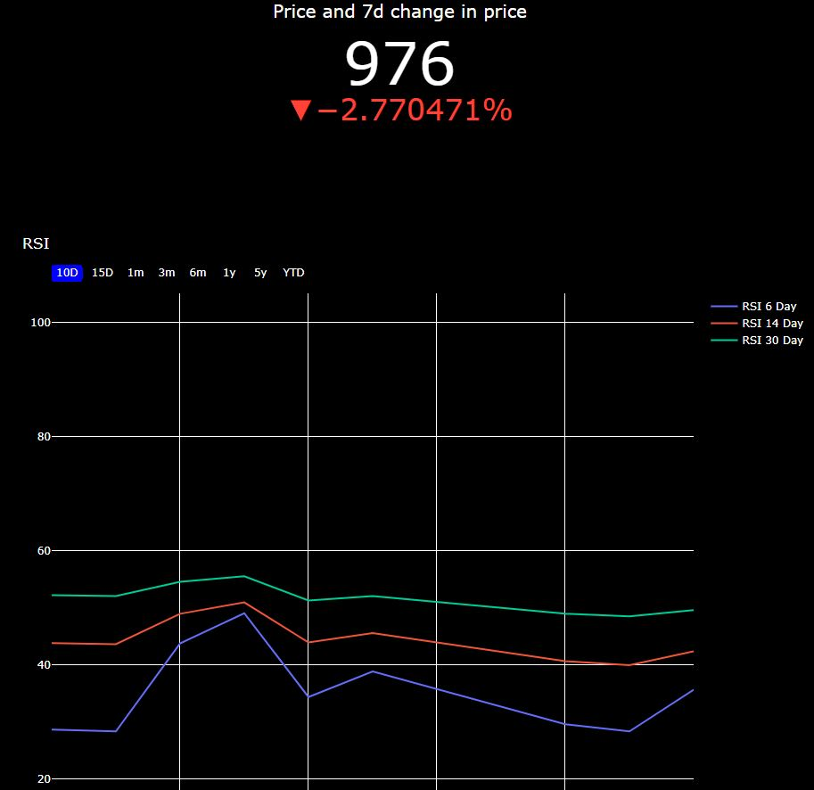

# python-github-actions-example

Example for creating a simple CI/CD pipeline for a Python Project using Github Actions.

## What is CI/CD?
With the continuous method of software development, developers often continuously build, test, and deploy iterative code changes. This iterative process reduces the chance that new code created is  buggy . With this method, there is less human intervention or even no intervention at all, from the development of new code until its deployment.

## Continuous integration
Each change submitted to an application, even to development branches, is built and tested automatically and continuously. These tests ensure the changes pass all tests, guidelines, and code compliance standards you established for your application.

## Continuous deployment
Continuous deployment checks the code automatically, and does not requires human intervention to manually and strategically trigger the deployment of the changes. Through this, developer can reduce the routine manual labour and focus on higher value output.

## Motivation of the project
- Develop a GITLAB workflow for CI/CD of python based web app with 2 examples of Flask and Dash.
- Enable easy deployment by just adjusting the src folder app.py.
- Continually evolving data with new metrics of focus or analysis methods.
- Covid 19 data and S&P 500 data

## Outcome
Dash dashboard that returns a random stock ticker from a list of selected companies namely FAANG, Tesla, GM , Ford and others like Microsoft.

## Steps
### Iteration 1:
Develop workflow that can render Hello World Flask App and successfully link to Heroku.
### Iteration 2:
Try out with task master app to observe if Flask CRUD functions can work.

### Iteration 3: 
Edit to do with COVID 19 dataset. Did locally but failed on heroku.

### Iteration 4:
Focus on End goal of stock market understanding and customisation of parameters such as Bollinger Bands and RSI to desired intervals instead of industry standard. 
- Initial(go indicator delta in absolute change instead of relative)

- After(improved indicator and RSI for 6,14 and 30)

### Iteration 5:
Add on perhaps news feed via API to focus on articles on Dashboard at side.Compare with S&P500 returns as well.
## Challenges
### 1) Setting up environment variables and compatability of software version. Complete requirements.txt

### 2) Procfile difference between Flask app and Dash. Flask app uses command app:app while Dash involves app:server.

### 3) Heroku inability to find local files. (Trying to find a go around). Current solution involves utilising data from yahoo finance stock info.

### 4) Problem with yahoo finance stock info due to stock splits as compared to google. E.g of AAPL which will result in difficulty in visualising.
Before(problem with split which affected BOLL)

After

# Docker Container in Dockerhub

pushed to [Docker Hub](https://hub.docker.com/r/ssean89/python-docker-dash-stock)
- In google cloud shell
1) Run with: `docker run -d -p 8080:8080 ssean89/python-docker-dash-stock`
2) Perform check below or just open in web preview
3) docker ps
4) docker images
5) docker logs container id

## View on Heroku
Visit this link to see the deployed app on Heroku.
https://protected-inlet-84479.herokuapp.com/

## Initialisation process
Step 1. Create a new folder for your project/clone a repo.

Step 2. Virtual environment
$ virtualenv venv # creates a virtualenv called "venv"
$ source venv/bin/activate # uses the virtualenv
virtualenv creates a fresh Python instance. You will need to reinstall your app's dependencies with this virtualenv

Step 3. $ pip install -r requirements.txt

Step 4. procfile settings
Procfile
1)web: gunicorn app:server
(Note that app refers to the filename app.py. server refers to the variable server inside that file).
For using Dash.
2)web: gunicorn app:app

Step 5. Just test out with a simple hello world app and assert hello world test to check that workflow is working.

Step 6. CI/CD by focusing on app.py and tests

## Types of test
-Logic test for number of ticker
-Data validation test. I.e price of AAPL maximum.

